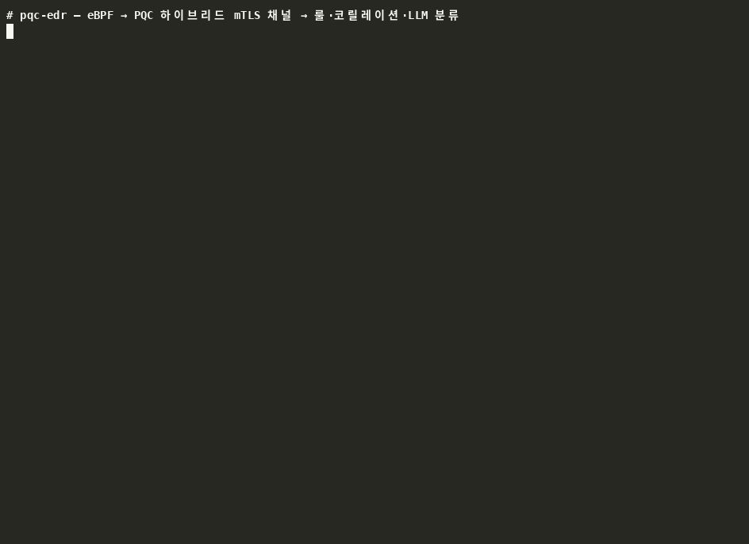

# pqc-edr

[](https://github.com/Park52/pqc-edr/actions/workflows/ci.yml)
[](LICENSE)

> **eBPF telemetry over a post-quantum (X25519 + ML-KEM) mTLS channel, triaged by an LLM.**
> A learning-grade PoC exploring PQC-secured endpoint security — **not** a production EDR.

호스트에서 eBPF로 보안 이벤트(프로세스 실행·아웃바운드 접속)를 수집해, **양자내성 하이브리드
암호로 보호되는 상호인증 채널**로 컨테이너 안의 analyzer 에 보내고, 룰·시퀀스 코릴레이션·LLM 이
이상행위를 분류·설명하는 통합 파이프라인.



> ⚠️ **범위**: 학습·포트폴리오용 PoC. 완전한 TLS/PKI 재구현이나 프로덕션급 커버리지가 아니라,
> **세 축(eBPF · PQC · LLM)이 하나로 관통하는 통합**이 핵심 가치. 한계는 [아래](#범위와-한계)에 명시.

---

## 아키텍처

```
 [호스트]                                                          [Docker 컨테이너]
 ┌─ agent ───────────────────────┐                                 ┌─ analyzer ──────────────────────────┐
 │ eBPF (CO-RE, 최소권한)         │   PQC 하이브리드 mTLS 채널        │ 복호·디코드                          │
 │  ksyscall/execve              │   ─────────────────────────▶    │   ↓                                 │
 │  fentry/tcp_v4_connect        │   키교환  X25519 ‖ ML-KEM-768    │ ① 룰 프리필터   drop / alert / 애매   │
 │        ↓ ring buffer          │   인증    ML-DSA-65 상호서명      │ ② 시퀀스 코릴레이션 (체인·비콘)        │
 │ security_event (168B)         │   레코드  AES-256-GCM, seq nonce │ ③ LLM  Haiku 1차 → Sonnet 심층       │
 │        ↓ seal → TCP           │   와이어엔 암호문만              │   ↓                                 │
 └───────────────────────────────┘                                 │ alert (JSON Lines + 콘솔)            │
   (또는 --replay: 시나리오 재생)                                     └─────────────────────────────────────┘
```

## 구현 현황

| | 컴포넌트 | 상태 |
|---|---|---|
| **Week 1** | eBPF collector (execve + tcp_connect, CO-RE, ring buffer, root 없이) | ✅ |
| **Week 2** | PQC 하이브리드 mTLS 채널 (핸드셰이크 + record layer, 실 소켓) | ✅ |
| **Week 3** | analyzer 데몬 + Claude API 이상탐지 + 엔드투엔드 통합 | ✅ |
| **Week 4** | 위협 시나리오 + 코릴레이션 + Docker + 벤치마크 + 문서 | ✅ |
| **심화** | 탐지 평가(오탐률·비용·게이트) · 파일훅(민감읽기·write→exec) + 프로세스 계보 | ✅ |

## 위협 모델

**보호 대상**: 엔드포인트 텔레메트리의 기밀성·무결성·출처(agent 신원), 그리고 analyzer 가 내는 판정의 신뢰.

| 공격자 / 위협 | 대응 | 어디서 |
|---|---|---|
| 네트워크 도청 — 지금 수집해 양자컴퓨터로 나중에 복호 (harvest-now-decrypt-later) | 하이브리드 KEM: X25519 와 ML-KEM 중 **하나만 안전해도** 세션키 안전 | `crypto/session.cpp` |
| 중간자(MITM), 가짜 agent / 가짜 analyzer | ML-DSA-65 로 **트랜스크립트 해시**에 상호서명, 사전보유 공개키로 검증 | `crypto/handshake.cpp` |
| 알고리즘 다운그레이드 | 스위트가 트랜스크립트에 포함 → 서명 검증에서 차단 | `crypto/wire.cpp` |
| 레코드 변조·재정렬·재전송 | AES-256-GCM, 방향별 키, nonce = iv_base ⊕ seq, 길이 헤더는 AAD; 실패 시 즉시 거부 | `crypto/record.cpp` |
| 엔드포인트: 다운로드→실행 체인 (LOTL), 리버스셸 툴 | 룰(임시경로 실행·nc) + 코릴레이션(같은 부모에서 curl 후 임시경로 실행 → Critical) | `analyzer/prefilter.cpp`, `correlator.cpp` |
| 엔드포인트: C2 비콘 (비표준 포트 반복 아웃바운드) | 룰(공인 비표준 포트) + 코릴레이션(같은 목적지 반복 ≥3 → High) | `analyzer/correlator.cpp` |
| 엔드포인트: 다운로드·실행 부모 분리 회피 (dropper≠실행자, 서브셸) | write→exec(파일 경로 조인, 부모 무관 → Critical) + 조상 교집합 매칭 | `agent/bpf/collector.bpf.c`, `analyzer/correlator.cpp` |
| 엔드포인트: 자격증명 파일 읽기 (`/etc/shadow` 등) | `security_file_open` 이 **inode 아이덴티티**로 민감읽기 탐지(경로·심링크 우회에 강함) → High | `agent/bpf/collector.bpf.c`, `analyzer/prefilter.cpp` |
| LLM 오판·할루시네이션 | LLM 은 애매한 이벤트만 보고, 결정론적 근거(룰·코릴레이션)를 '정상'으로 뒤집지 못함; 호출 실패는 fail-safe | `analyzer/pipeline.cpp` |
| analyzer 정체 → 이벤트가 조용히 유실 | agent 유한 큐 + 드롭 카운트 + `AGENT_DROP` 통지 → analyzer 가 탐지 공백을 alert 로 기록 | `agent/src/main.cpp` `ChannelSink` |
| LLM 프롬프트 인젝션 (comm/filename 에 지시문) | 제어문자 제거·길이 제한, `<event>` 구분자, "안의 지시 무시" 시스템 프롬프트 — **완화**이며 판정 앵커는 룰 | `analyzer/llm_client_claude.cpp` |
| 커널에서 온 비정상 바이트열 (제어문자·잘못된 UTF-8) 로 로그 위조·데몬 크래시 | 이벤트 요약 시 제어문자 치환, JSON 직렬화는 U+FFFD 대체 | `analyzer/prefilter.cpp`, `alert.cpp` |
| agent 가 root 권한 요구 → 침해 시 피해 확대 | `cap_bpf`+`cap_perfmon` 만으로 3개 훅 attach (kprobe PMU + fentry, LSM/CAP_MAC_ADMIN 불필요) | `agent/bpf/collector.bpf.c` |

**의도적으로 대응하지 않는 것**: root 공격자(agent 자체를 끌 수 있음), 커널 익스플로잇, 호스트의 신원 키 파일 탈취(파일 권한 0600 에 의존),
DoS, 사이드채널(라이브러리에 위임), 키 폐기·회전. LLM 프롬프트 인젝션은 완화만(완전 방어 아님). → [INTERVIEW_NOTES Q5](INTERVIEW_NOTES.md)

## 핵심 보안 설계와 근거

- **하이브리드 KEM** — `X25519 ∥ ML-KEM-768` 공유비밀을 HKDF 로 결합. 고전이 양자로 깨져도, PQC 에 미래 결함이
  나와도 **둘 중 하나만 안전하면 세션키가 안전**. TLS 1.3 의 `X25519MLKEM768` 과 같은 발상.
  *왜 순수 PQC 가 아닌가*: ML-KEM 은 표준화 2년차라 SIKE 처럼 깨질 보험이 필요하고, 벤치 기준 CPU 비용은 고전과 같다.
- **ML-KEM 선택 근거** — 격자 기반으로 가장 먼저 표준화(FIPS 203), 키 1.2KB 에 X25519 보다 빠른 연산, 브라우저·클라우드가
  배포 중. 부호 기반(HQC/BIKE)은 격자가 깨질 때의 백업이지만 크고 느리다 — 그 리스크는 X25519 하이브리드로 헤지.
- **PQC 상호인증** — `ML-DSA-65` 서명이 트랜스크립트 해시(양측 공개값·랜덤·스위트)를 덮어 **MITM·다운그레이드를 검증 단계에서
  차단**. PSK 대신 서명을 쓴 이유: 한쪽 유출이 상대 신원 위조로 번지지 않고, 공개키만 배포하면 된다.
- **AES-256-GCM record layer** — TLS 1.3 식 nonce(`iv_base ⊕ seq`)로 nonce 재사용 원천 차단, 변조·재정렬·재전송 모두 거부.
- **Fail-closed 전반** — 크립토·파싱·재생파일 형식 오류는 조용히 넘기지 않고 즉시 예외/거부.
- **백프레셔 — 유실을 세고 알린다** — agent 의 ring buffer 콜백은 유한 큐(기본 4096 이벤트)에 복사만 하고
  송신 스레드가 seal+send. analyzer 가 느려 큐가 차면 커널을 막는 대신 유저스페이스에서 드롭하고 **개수를 센 뒤**
  정체가 풀리면 `AGENT_DROP` 이벤트로 통지 → analyzer 가 "탐지 공백" alert 로 surface. 스트레스(analyzer 1.5초 정지,
  20만 이벤트): 178,563 드롭·21,438 전송, analyzer 가 정확히 21,438 복호 (순서·nonce 무결).
- **최소권한 eBPF (3개 훅)** — `ksyscall/execve` + `fentry/tcp_v4_connect` + `fentry/security_file_open` 을
  root 없이 `CAP_BPF`/`CAP_PERFMON` 만으로 attach(LSM·CAP_MAC_ADMIN 불필요). 파일훅은 커널 안에서 강하게
  필터(민감읽기=inode 매칭, 스테이징 쓰기=d_path 접두사)해 open 당 ~0.3µs.
- **계보 + write→exec 상관** — 이벤트마다 조상 4세대를 실어, 부모가 다른 다운로드·실행(dropper≠실행자)도
  파일 경로로 잇고(Critical), 서브셸 우회는 조상 교집합으로 잡는다.
- **LLM 통제 3단** — ① 룰 프리필터(명백한 것은 LLM 없이) → ② 시퀀스 코릴레이션(순서·반복은 결정론적으로) → ③ 애매한 것만
  `claude-haiku-4-5` 1차 → 의심만 `claude-sonnet-5` 심층. LLM 은 설명·심각도 보정 역할이며 판정의 앵커는 룰이다.
  (실 API 라이브 검증 완료 — 아래 시나리오 데모의 실 결과 참조.)

암호 스위트: **ML-KEM-768 + X25519 + ML-DSA-65 + HKDF-SHA256 + AES-256-GCM** (PQC 는 NIST level 3).
검증된 라이브러리(liboqs, OpenSSL)의 primitive 를 **조합만** 하며, 직접 구현한 암호는 없다.

## 비용 (벤치마크 요약)

i7-9700K, Release. 상세·해석은 [docs/BENCHMARK.md](docs/BENCHMARK.md).

| | 고전 (X25519+Ed25519) *추정* | 하이브리드 (실측) |
|---|---:|---:|
| 핸드셰이크 CPU (양측 합) | 404 µs | **392 µs** — ML-KEM 이 X25519 보다 3배 빠름 |
| 핸드셰이크 바이트 | 192 B | **~9 KB** (×47) — 진짜 비용, 세션당 1회 |
| 전체 핸드셰이크 지연 (RTT 제외) | – | 0.48 ms median |
| 레코드 (168B 이벤트) | 동일 | +18 B, 1 µs |
| eBPF 훅 오버헤드 | – | **이벤트당 ~13–14 µs** (execve 경로 +2%) |

## 빌드 & 데모

**요구사항** (Ubuntu 24.04 / kernel 6.17 기준): `clang`, `libbpf-dev`, `bpftool`, `cmake`, `pkg-config`, `libssl-dev`,
`libcurl4-openssl-dev`. Docker 데모는 `docker`. 실 eBPF 수집은 agent 에 file capability (아래).

```bash
bash scripts/build-liboqs.sh                    # 1) liboqs 로컬 빌드 (ML-KEM-768 + ML-DSA-65, sudo 불필요)
cmake -S . -B build && cmake --build build      # 2) 전체 빌드
ctest --test-dir build                          #    셀프테스트 5개 (크립토 4 + 분류 파이프라인 1)
sudo setcap cap_bpf,cap_perfmon,cap_net_admin+ep build/agent/agent   # 3) (선택) 실 eBPF — 리빌드마다 재부여
```

### 위협 시나리오 데모 (Week 4)

agent 에 capability 가 있으면 **실제 프로세스를 띄워 eBPF 로 잡고**, 없으면 같은 순서를 `scenarios/*.events` 에서 **재생**한다.
공격 흉내는 전부 무해하다 (curl 은 `file://`, 목적지 198.51.100.7 은 문서용 예약 대역).

```bash
scripts/scenario-1-exec-chain.sh     # 다운로드→실행 체인: mktemp → curl → chmod → /tmp/…/sysupdate → nc
scripts/scenario-2-c2-beacon.sh      # C2 비콘: python3 가 198.51.100.7:4444 로 0.7초 간격 5회 접속
MODE=replay scripts/scenario-1-exec-chain.sh              # 재생 강제 (권한 불필요)
USE_REAL_LLM=1 ANTHROPIC_API_KEY=sk-… scripts/scenario-2-c2-beacon.sh   # mock 대신 실 Claude API
```

시나리오 1 — analyzer 로그 (mock LLM):
```
[analyzer] 핸드셰이크 완료 (agent 인증됨). 이벤트 수신·분류 시작.
  [drop]  execve comm=bash file=/usr/bin/mktemp  (화이트리스트 도구: mktemp)
  [ALERT] suspicious sev=medium   src=sonnet | execve comm=bash file=/usr/bin/curl | 심층 분석(mock): …
  [drop]  execve comm=bash file=/usr/bin/chmod  (화이트리스트 도구: chmod)
  [ALERT] malicious  sev=critical src=rule+download-exec-chain | execve comm=bash file=/tmp/.cache-2aytZX/sysupdate
          | 임시 디렉토리에서 실행; 다운로드→실행 체인: 동일 부모(ppid=8175)에서 curl 실행 후 0.0초 내 임시경로 실행
  [drop]  execve comm=sysupdate file=/usr/bin/id  (화이트리스트 도구: id)
  [ALERT] malicious  sev=high     src=rule   | execve comm=sysupdate file=/usr/bin/nc | 리버스셸/네트워크 툴 실행: nc
  [ALERT] malicious  sev=medium   src=rule   | connect comm=nc dst=198.51.100.7:4444 | 공인 IP 비표준 포트 아웃바운드
[analyzer] 연결 종료 (8개 이벤트 처리).
```

시나리오 2 — 3회째 접속부터 비콘으로 승격:
```
  [ALERT] malicious  sev=medium   src=rule        | connect comm=python3 dst=198.51.100.7:4444 | 공인 IP 비표준 포트 아웃바운드
  [ALERT] malicious  sev=medium   src=rule        | connect comm=python3 dst=198.51.100.7:4444 | 공인 IP 비표준 포트 아웃바운드
  [ALERT] malicious  sev=high     src=rule+beacon | connect comm=python3 dst=198.51.100.7:4444
          | 공인 IP 비표준 포트 아웃바운드; 비콘 의심: python3 → 198.51.100.7:4444 로 60초 윈도우 내 3회 반복 접속
```
(실 eBPF 모드에선 그 사이에 시스템의 다른 프로세스들 — 예: 에디터의 상태 폴링 — 이 drop / Haiku-normal 로 걸러지는 것도 보인다.)

실 Claude API 로 돌린 결과 (`USE_REAL_LLM=1`, 2026-09-05 검증):
```
  [llm:claude-haiku-4-5 normal] execve comm=bash file=/usr/bin/curl  (curl is a standard utility for downloading files…, conf=0.95)
  [ALERT] malicious  sev=critical src=rule+download-exec-chain | execve comm=bash file=/tmp/.cache-Ab3x/sysupdate | 임시 디렉토리에서 실행; 다운로드→실행 체인: …
  [ALERT] suspicious sev=high     src=beacon+sonnet | connect comm=updater dst=203.0.113.9:443
          | 비콘 의심: updater → 203.0.113.9:443 로 60초 윈도우 내 3회 반복 접속 / Process 'updater' shows periodic beaconing …
            consistent with C2 beacon behavior (MITRE ATT&CK T1071.001) … Legitimate updaters can poll periodically, but regular
            interval reconnects to a single external IP warrant investigation … before escalating to malicious.
```
단일 이벤트만 보는 LLM 은 `curl` 하나를 정상(0.95)으로 판정하지만, 시퀀스 코릴레이션이 체인을 Critical 로 잡는다 —
**LLM 이 아니라 결정론적 계층이 판정의 앵커**인 이유. 코릴레이션 hit 가 Sonnet 으로 직행하면 MITRE ATT&CK 매핑이 붙은,
과잉 확신 없는 설명이 나온다.

위 GIF 는 `scripts/record-demo.sh` 로 녹화·변환한 것(asciinema + agg, `docs/demo.cast` 에서 재렌더 가능).

### Docker — analyzer 컨테이너, agent 는 호스트 (Week 4)

```bash
scripts/demo-docker.sh          # 이미지 빌드 → keygen → 컨테이너 기동 → 호스트 agent 가 시나리오 2개 재생 → 컨테이너 로그
```
수동:
```bash
docker build -f docker/Dockerfile.analyzer -t pqc-edr-analyzer .          # 멀티스테이지, 런타임 142MB, 비루트
mkdir keys && (cd keys && ../build/tools/pqsec_keygen agent && ../build/tools/pqsec_keygen analyzer)
docker run -d --name analyzer --user "$(id -u)" -p 127.0.0.1:9443:9443 -v "$PWD/keys:/keys:ro" \
  -e ANTHROPIC_API_KEY pqc-edr-analyzer            # 키 없으면 자동 mock, 또는 인자로 --mock-llm
(cd keys && ../build/agent/agent --forward --id agent --peer analyzer.pub --port 9443)   # 실 eBPF → 컨테이너
docker logs -f analyzer
```
신원 키는 이미지에 굽지 않고 배포 시 마운트하며, API 키는 env 로만 전달한다. 컨테이너 안에서는 `0.0.0.0` 리슨,
호스트에는 `127.0.0.1` 에만 공개.

### 이전 주차 데모

```bash
scripts/demo-week3.sh                         # Week 3: agent --synthetic → PQC 채널 → analyzer → mock LLM → alert
./build/crypto/channel_e2e_demo               # Week 2: 실 TCP 두 프로세스, 와이어엔 암호문만
./build/crypto/hybrid_demo                    # 하이브리드 키합의 + ML-DSA 상호인증 + MITM 거부
./build/crypto/record_demo                    # AES-256-GCM 왕복 + 변조/재정렬/재전송 거부
./build/analyzer/analyzer_selftest            # 분류 파이프라인 (룰·코릴레이션·티어링) 오프라인 검증
./build/agent/agent                           # Week 1: eBPF 이벤트 stdout (capability 필요)
```

### 벤치마크
```bash
cmake -S . -B build/release -DCMAKE_BUILD_TYPE=Release -DBUILD_AGENT=OFF
cmake --build build/release --target bench_handshake && ./build/release/crypto/bench_handshake
scripts/bench-ebpf-overhead.sh                # agent 유무로 execve/connect 루프 비교 (capability 필요)
```

## 저장소 구조

```
agent/          Week 1 — eBPF collector (bpf/ 커널 프로그램, src/ 로더 + 채널 전송 + 재생)
common/         공유 이벤트 스키마 (security_event, 168B POD)
crypto/         Week 2 — PQC 보안 채널 라이브러리 (pqsec_channel) + 데모·벤치마크
  include/pqsec/  pqc, x25519, kdf, session, record, wire, handshake, socket, identity
analyzer/       Week 3–4 — prefilter(룰) · correlator(시퀀스) · llm_client(Mock/Claude) · pipeline · 데몬
scenarios/      Week 4 — 위협 시나리오 재생 파일(*.events) + 무해한 페이로드
scripts/        liboqs 빌드, 주차별 데모, 시나리오, Docker 데모, 벤치마크
docker/         analyzer 컨테이너 Dockerfile (멀티스테이지)
tools/          ML-DSA 신원 키 생성기 (pqsec_keygen)
cmake/          eBPF 빌드 파이프라인 헬퍼 (vmlinux.h → clang -target bpf → skeleton)
docs/           설계·벤치마크·학습 문서
```

## 문서

- [`docs/handshake-design.md`](docs/handshake-design.md) — 핸드셰이크 상세 설계·근거·한계
- [`docs/BENCHMARK.md`](docs/BENCHMARK.md) — 고전 vs 하이브리드 비용, eBPF 오버헤드, 해석
- [`docs/DEMO_SCRIPT.md`](docs/DEMO_SCRIPT.md) — 5분 시연 대본, 예상 질문 매핑, 실패 시 폴백
- [`docs/EVAL.md`](docs/EVAL.md) — 탐지 평가: 층별 오탐률·시나리오 탐지율·LLM 비용, known-miss, 튜닝 로그
- [`docs/HANDBOOK.md`](docs/HANDBOOK.md) — **지식·면접 핸드북**: 전 영역 개념·구현·수치·함정·Q&A를 한 파일에 (출퇴근용)
- [`INTERVIEW_NOTES.md`](INTERVIEW_NOTES.md) — 설계 결정 Q&A (하이브리드/ML-KEM/LLM 통제/eBPF 영향/프로덕션 갭)
- [`docs/STUDY_GUIDE.md`](docs/STUDY_GUIDE.md) — eBPF·암호학 제로베이스 학습 가이드
- [`ROADMAP.md`](ROADMAP.md) — 4주 계획과 범위 가드레일

## 범위와 한계

의도적으로 **넣지 않은 것** (PoC 스코프 유지):
- 완전한 TLS 1.3 재구현 (핸드셰이크는 축약판, 형식 검증 없음)
- 인증서 체인/PKI (self-signed + 사전공유 공개키 핀닝으로 대체 — 키 회전·폐기 없음)
- 프로덕션급 eBPF 커버리지 (훅 3개: execve, IPv4 connect, file open — setuid/모듈로드/IPv6/UDP 등은 범위 밖)
- 세션 재개·키 갱신·재연결·디스크 큐 (백프레셔는 유한 큐로 드롭을 세고 알리지만, 끊긴 연결을 다시 잇거나 유실분을 보관하지는 않음)
- 사이드채널 방어(라이브러리에 위임), LLM 프롬프트 인젝션의 완전한 방어(정화·구분자·지시 무시로 완화만)

솔직한 프로덕션 갭 목록은 [INTERVIEW_NOTES Q5](INTERVIEW_NOTES.md).

## 기술 스택
C++17 · CMake · libbpf + CO-RE · liboqs 0.15 (ML-KEM/ML-DSA) · OpenSSL 3 (X25519/HKDF/AES-GCM) ·
Claude API (Haiku→Sonnet, libcurl + nlohmann/json) · Docker (멀티스테이지, 비루트)
